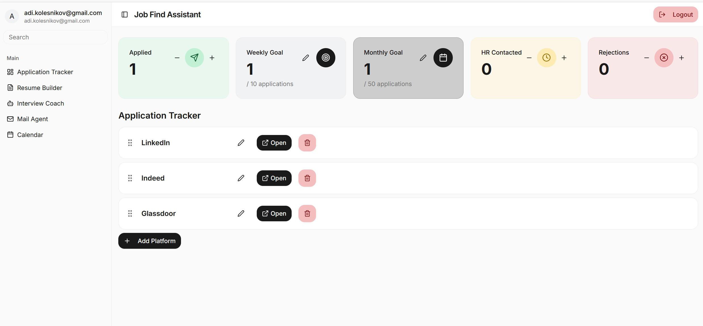

## Job Find Assistant

A personal AI-powered job search manager.

Job Find Assistant helps you stay organized during your job hunt:

🗂 Application Tracker – manage job applications across multiple platforms.

🧾 Resume Builder – craft and refine your resume for each position.

🤖 AI Interview Coach – practice and improve your interview skills via STAR presentation.

📬 AI Mail Agent – monitor and analyze job responses.

📅 Calendar – Track interviews.

> Application tracker screenshot

## Project info

**URL**: https://job-find-assistant.lovable.app

## What technologies are used for this project?

This project is built with:

- Vite
- TypeScript
- React
- shadcn-ui
- Tailwind CSS

## What is the testing approach?

- UI/UX test using Playwright/Type Script
- API testing using Playwright/Type Script

# 🔐 User Story: User Authentication & Registration

## User Story

**As a** user  
**I want to** log in to the application using my email and password or Google OAuth provider  
**So that** my progress and data — including applications, notes, and goals — are saved and available next time I log in

---

## Acceptance Criteria

### 1. Initial Visit & Registration

- **Given** I am a new user visiting the site
- **When** I land on the homepage
- **Then** I should be greeted with a registration and login form

### 2. Email Registration

- **Given** I am on the registration page
- **When** I enter my email and password
- **Then** I should be able to register successfully using email and password

### 3. Google OAuth Registration

- **Given** I am on the registration page
- **When** I click "Sign up with Google"
- **Then** I should be able to register using my Google account

### 4. Post-Registration Access

- **Given** I have successfully registered
- **When** I complete the registration process
- **Then** I should be automatically logged in and redirected to the management dashboard

### 5. Data Management

- **Given** I am an authenticated user
- **When** I access the dashboard
- **Then** I should be able to manage my data on the website (applications, notes, goals)

### 6. Data Persistence

- **Given** I am a logged-in user with saved data
- **When** I log out
- **Then** my data should remain stored in the system

### 7. Protected Routes

- **Given** I am an unauthenticated user
- **When** I try to access the dashboard
- **Then** I should be redirected to the login page and cannot access protected content

---

## Dependencies

- User authentication system (email/password & OAuth)
- Google OAuth API integration
- Database for storing user credentials and data
- Session management system

---

## Definition of Done

- [ ] Registration form is visible to new users
- [ ] Email/password registration works correctly
- [ ] Google OAuth registration is functional
- [ ] Users are redirected to dashboard after successful registration
- [ ] Authenticated users can manage their data
- [ ] Data persists after logout
- [ ] Unauthenticated users cannot access protected routes
- [ ] Password encryption is implemented
- [ ] Form validation is working
- [ ] Error messages display appropriately
- [ ] User acceptance testing completed

---

> **Note**: Ensure proper security measures including password hashing, HTTPS, and secure session management are implemented.

# 🗂 User Story: Application Tracker

**As a** job seeker actively applying to positions across different job boards  
**I want to** manage and track all my applications in one place with progress metrics  
**So that** I can stay organized, meet my application goals, and understand my job search performance

---

## Acceptance Criteria

### 1. Dashboard Overview

- **Given** I am logged into the Job Find Assistant application
- **When** I navigate to the Application Tracker
- **Then** I should see:
  - Total applications submitted
  - Weekly goal progress
  - Monthly goal progress
  - HR contacted count
  - Rejections count

### 2. Multi-Platform Management

- **Given** I am tracking applications across different platforms
- **When** I view the Application Tracker
- **Then** I should see a list of platforms including:
  - LinkedIn
  - Indeed
  - Glassdoor
- **And** each platform should have:
  - Drag handle for reordering
  - Edit button
  - "Open" button to access the platform
  - Delete button

### 3. Goal Tracking

- **Given** I have set weekly and monthly application goals
- **When** I submit applications
- **Then** the dashboard should:
  - Update the Applied counter
  - Show progress toward Weekly Goal (current/target)
  - Show progress toward Monthly Goal (current/target)
  - Allow me to edit goals via edit icons

### 4. Platform Actions

- **Given** I have platforms configured
- **When** I click "Open" on a platform
- **Then** the platform's website should open in a new tab
- **When** I click the edit icon
- **Then** I should be able to modify platform details
- **When** I click the delete icon
- **Then** the platform should be removed from my tracker

### 5. Add New Platform

- **Given** I want to track applications from a new job board
- **When** I click "+ Add Platform"
- **Then** I should be able to add a new platform to my tracker

---

## Dependencies

- User authentication system
- Database for storing application data

---

## Definition of Done

- [ ] User can view all metrics on dashboard
- [ ] User can add/edit/delete platforms
- [ ] User can open platforms in new tabs
- [ ] Goals can be set and edited
- [ ] Counters update correctly
- [ ] Data persists across sessions
- [ ] Responsive design works on all browsers
- [ ] User acceptance testing completed

